<h1 align="left">Hello World!! 👋</h1>

BCA student learning Frontend Development

## About me

 Building modern, responsive, and user-friendly web applications using <b>React.js</b>, JavaScript, and modern frontend technologies. Currently improving my skills in advanced React concepts, state management, and frontend architecture.

## I code with

  
  
  
  
  
  
  
  
  
  
  
  
  

## Connect with me

  

---

## 📊 GitHub Stats

  
  

## 👾 Pac-Man Contribution Graph

<picture>
    <source media="(prefers-color-scheme: dark)" srcset="https://raw.githubusercontent.com/Prashant6307/Prashant6307/output/pacman-contribution-graph-dark.svg">
    <source media="(prefers-color-scheme: light)" srcset="https://raw.githubusercontent.com/Prashant6307/Prashant6307/output/pacman-contribution-graph.svg">
    
</picture>

---

⭐️ Thanks for visiting my profile!
